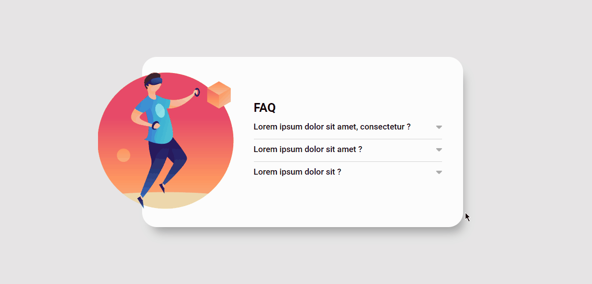

# Challenge DevQuest - FAQ accordion solution

This is solution the challenge FAQ accordion.
the project was developed through the challenge DevQuest.

## About the challenge 

- With this project, users can hide/show the answer to a question when the question is clicked.
- When clicking on the question it will show the answer to each question.
- When clicking on a question, the previous element will.

## Screenshot
 - DESKTOP/MOBILE
 

### Built with

- Semantic HTMK5 markup
- CSS and FLEXBOX
- JavaScript

### what I learned and what I had difficulty with

in this project i had quite difficult in execute part hide/show with JavaScript, but with help from devquest course
be able to overcome this challeng.

With this I learned how to perform the hide/show challenge in a simple and practical way.
